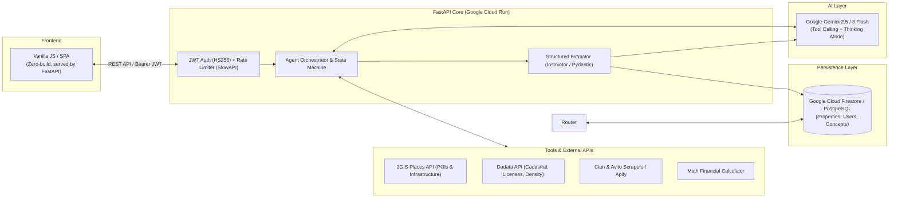

# 🏢 Neks Agents — Commercial Real Estate AI Intelligence Platform

> **Flagship Project** | Multi-Agent AI Platform for Highest & Best Use (HBU) Analysis, Due Diligence & Tenant Mix Modeling.

[](https://www.python.org/)
[](https://fastapi.tiangolo.com/)
[](https://ai.google.dev/)
[](https://cloud.google.com/firestore)
[](https://cloud.google.com/run)

[🇷🇺 Читать на русском](README_RU.md)

---

## 📺 60–90s Demo Video
> 🎥 **[Watch Platform Demo (Loom / YouTube) ↗](https://github.com/Creeepling/neks_agents)**  
> *(Walkthrough: conversational agent launch, 2GIS/DaData geospatial tool calling, structured data extraction, and property state management)*

---

## 🎯 Business Problem Solved
Commercial real estate pre-acquisition analysis and Highest & Best Use (HBU) concept modeling manually take **3 to 5 business days (24–40 analyst hours)**. The workflow is heavily fragmented across disparate registries (cadastral records, geospatial data, license registers, market listings), leading to lost context and error-prone assumptions.

**Neks Agents** automates this pipeline through a sequential multi-agent AI architecture. Users engage in domain-specific conversational sessions with autonomous AI specialists, while the platform deterministically extracts validated facts into a unified property knowledge graph without context loss.

---

## 👨‍💻 My Role & Key Contributions
Designed and implemented the platform from scratch:
- **Backend Architecture:** Built a modular asynchronous FastAPI (Python 3.12) server with session isolation and rate limiting.
- **LLM Orchestration & Structured Extraction:** Designed a two-phase conversation and extraction pipeline (`/commit`) using `instructor` and Pydantic v2 (guaranteeing 100% type-safe JSON persistence without LLM hallucinations).
- **Tool-Calling Ecosystem:** Implemented a unified Tool Registry integrating 2GIS Places API (infrastructure/POIs), DaData API (cadastral data, legal entity density, alcohol/medical licenses), and market scrapers.
- **Retailer Matching & Financial Calculator:** Developed constraint-matching logic against a NoSQL Firestore database of retailer requirements (sqm, kW) and financial feasibility modeling (NOI, yield, payback).
- **DevOps & Cloud Deployment:** Containerized with multi-stage Docker and deployed to Google Cloud Run with Firestore Native and Google Secret Manager.

> ℹ️ **Note on Git Commit History:**  
> All commits authored by `Neks Dev <dev@neks.local>` are my personal commits authored in my local development environment.

---

## 🏛 System Architecture



---

## ⚙️ Key Engineering Decisions & Rationale

1. **Two-Phase Extraction (`/commit`) vs. Pure JSON Chat:**  
   *Why:* Natural language dialogue allows fluid exploration, but is risky for database integrity. Calling `instructor` at step completion guarantees strict Pydantic validation (types, enums, nested lists) before writing to the database.
2. **Declarative Agent Pipeline (`agents.yaml` + Firestore):**  
   *Why:* System prompts, tool assignments, and JSON schemas are decoupled from application code. New specialized agent roles can be introduced or modified at runtime without backend rebuilds.
3. **Unified Single-Container Serving (FastAPI + SPA Static):**  
   *Why:* FastAPI directly serves the zero-build SPA frontend on the root path `/`. This eliminates CORS complexity, simplifies deployment to Google Cloud Run into a single container, and guarantees frontend-backend version parity.
4. **Security & Reliability:**  
   *Actual security stack:* JWT authentication (OAuth2 Password Bearer) with `bcrypt` password hashing, endpoint rate limiting via `SlowAPI` (120 req/min), and secret management with Google Secret Manager.

---

## 🚦 Component Status: Production-Ready vs. Demo/Portfolio

| Module / Subsystem | Status | Implementation Details |
| :--- | :---: | :--- |
| **Auth, JWT, Rate Limiter** | ✅ **Active Core** | User registration, bcrypt password hashing, SlowAPI rate limiting. |
| **State Machine & Multi-Agent Loop** | ✅ **Active Core** | Step-by-step agent lifecycle, prerequisite validation (`/validate`), session isolation. |
| **Structured Commit (Instructor)** | ✅ **Active Core** | Schema-enforced chat extraction into typed Pydantic models. |
| **DaData & 2GIS Integrations** | ✅ **Active Core** | Geocoding, cadastral validation, legal entity density, and license checks. |
| **EGRN Document OCR Parser** | ✅ **Active Core** | Cadastral extract parsing and encumbrance extraction via Gemini Multimodal. |
| **Tenant Matching & FinCalc** | 🟡 **Demo / MVP** | Rule-based retailer constraint matching and unit economics modeling. |
| **Market Offers Scraper** | 🟡 **Demo / Lab** | Open-source listing scrapers (requires proxy rotation for high-load production). |

---

## 🚀 Local Development Setup

### 1. Create and Activate Virtual Environment
```bash
python -m venv .venv
# Windows:
.venv\Scripts\activate
# Mac/Linux:
source .venv/bin/activate
```

### 2. Install Dependencies
```bash
pip install -r requirements.txt
```

### 3. Configure Google Cloud Credentials
Authenticate your local environment to access Firestore:
```bash
gcloud auth application-default login
```
*(Or set `GOOGLE_APPLICATION_CREDENTIALS="path/to/service-account.json"` in your environment)*

### 4. Configure Environment Variables
Copy the template `.env.example` to `.env` and fill in your keys:

```bash
cp .env.example .env
```

Example `.env`:
```env
# Required: Google Gemini API Key (https://aistudio.google.com/)
GEMINI_API_KEY=your-gemini-api-key
GEMINI_MODEL=gemini-3-flash-preview

# Required: Firestore Configuration
FIRESTORE_PROJECT_ID=your-gcp-project-id
FIRESTORE_DATABASE_ID=neksagents

# Required: Secret Key for JWT Authentication
# Generate with: python -c "import secrets; print(secrets.token_hex(32))"
SECRET_KEY=your-secure-secret-key
ALGORITHM=HS256
ACCESS_TOKEN_EXPIRE_MINUTES=1440

# Optional / Tool Integrations:
DADATA_API_KEY=your-dadata-api-key
TWOGIS_API_KEY=your-2gis-api-key
APIFY_API_TOKEN=your-apify-token

# Optional: Telegram Diagnostics Notifications
TELEGRAM_BOT_TOKEN=your-bot-token
TELEGRAM_CHAT_ID=your-chat-id

ENVIRONMENT=local
```

### 5. Run the Development Server
```bash
uvicorn app.main:app --reload
```

- Web UI: `http://localhost:8000/`
- Interactive Swagger Docs: `http://localhost:8000/docs`
- OpenAPI Specification: `http://localhost:8000/openapi.json`

---

## 📡 API Overview

### Authentication
| Method | Endpoint | Description |
|--------|----------|-------------|
| `POST` | `/auth/register` | Register a new user |
| `POST` | `/auth/token` | Login and obtain JWT access token |

### Properties & Real Estate Objects
| Method | Endpoint | Description |
|--------|----------|-------------|
| `GET` | `/properties` | List all properties for current user |
| `POST` | `/properties` | Create a new property |
| `GET` | `/properties/{id}` | Get property details and accumulated JSON data |
| `PUT` | `/properties/{id}` | Update property details |
| `DELETE` | `/properties/{id}` | Delete property and associated data |
| `POST` | `/properties/{id}/documents` | Upload and summarize property document |
| `DELETE` | `/properties/{id}/documents/{doc_id}` | Remove document from property |
| `POST` | `/properties/{id}/egrn_extracts` | Upload and parse EGRN (Rosreestr) extract |
| `DELETE` | `/properties/{id}/egrn_extracts/{doc_id}` | Remove EGRN extract |
| `POST` | `/properties/{id}/cian_offers` | Trigger CIAN market offers scraping |
| `GET` | `/properties/{id}/cian_offers` | Retrieve saved CIAN market offers |
| `POST` | `/properties/{id}/cian_offers/clear` | Clear saved market offers |
| `POST` | `/properties/{id}/fetch_tenants` | Pull tenant infrastructure via 2GIS |
| `POST` | `/properties/{id}/fetch_tenants_ai` | AI-assisted tenant and foot-traffic discovery |

### Conversations & Agents
| Method | Endpoint | Description |
|--------|----------|-------------|
| `GET` | `/conversations/validate` | Pre-flight validation of prerequisite data for a step |
| `POST` | `/conversations` | Initialize a conversation for a property & agent step |
| `GET` | `/conversations/{id}` | Get conversation metadata and full message history |
| `POST` | `/conversations/{id}/message` | Send user message and get agent response (with tool execution) |
| `POST` | `/conversations/{id}/commit` | Extract structured schema data and merge into property |
| `POST` | `/conversations/{id}/complete` | Mark conversation as completed |
| `DELETE` | `/conversations/{id}` | Delete conversation |

### Retailers & Concepts
| Method | Endpoint | Description |
|--------|----------|-------------|
| `GET` | `/retailers` | List retail tenant requirement profiles |
| `POST` | `/retailers` | Create a retailer requirement profile |
| `PUT` | `/retailers/{id}` | Update retailer profile |
| `DELETE` | `/retailers/{id}` | Delete retailer profile |
| `POST` | `/retailers/auto-fill` | Auto-fill retailer profile data using AI |
| `GET` | `/concepts` | List commercial property concepts |
| `POST` | `/concepts` | Create a commercial concept |
| `PUT` | `/concepts/{id}` | Update commercial concept |
| `DELETE` | `/concepts/{id}` | Delete commercial concept |

### System & Pipeline Configuration
| Method | Endpoint | Description |
|--------|----------|-------------|
| `GET` | `/steps` | List active agent steps and metadata |
| `GET` | `/system/tools` | List available agent tools and descriptions |
| `GET` | `/system/agents-config/json` | Retrieve current agent pipeline configuration |
| `PUT` | `/system/agents-config/json` | Update pipeline configuration dynamically in Firestore |
| `POST` | `/system/agents-config/reset` | Reset pipeline configuration to default `agents.yaml` |
| `POST` | `/system/seed-retailers` | Seed default retail tenant profiles |
| `POST` | `/system/seed-concepts` | Seed default commercial concept profiles |

---

## 🛠 Agent Pipeline Configuration

Agent steps are declared in `agents.yaml` (or customized at runtime in Firestore). Each step defines:
- **`name`** & **`role`**: Descriptive title and system identity.
- **`system_prompt`**: Specialized instructions and analytical guidelines.
- **`tools`**: Bound capabilities (e.g. `twogis_maps`, `dadata_licenses`, `financial_calculator`).
- **`input_requirements`**: Prerequisite property fields checked before starting.
- **`output_schema`**: JSON Schema extracted upon `/commit` and merged into the property store.

---

## ☁️ Deployment (Google Cloud Run)

The application is containerized and optimized for Google Cloud Run with Firestore.

### 1. Build and Submit Container Image
```bash
export PROJECT_ID=your-gcp-project-id
export REGION=europe-west1

gcloud builds submit --tag gcr.io/$PROJECT_ID/neks-agents
```

### 2. Deploy to Cloud Run
```bash
gcloud run deploy neks-agents \
  --image gcr.io/$PROJECT_ID/neks-agents \
  --region $REGION \
  --allow-unauthenticated \
  --set-env-vars "FIRESTORE_PROJECT_ID=$PROJECT_ID,FIRESTORE_DATABASE_ID=neksagents,GEMINI_MODEL=gemini-3-flash-preview,ENVIRONMENT=production" \
  --set-secrets "GEMINI_API_KEY=GEMINI_API_KEY:latest,SECRET_KEY=SECRET_KEY:latest,DADATA_API_KEY=DADATA_API_KEY:latest,TWOGIS_API_KEY=TWOGIS_API_KEY:latest,APIFY_API_TOKEN=APIFY_API_TOKEN:latest"
```

> **Note**: Ensure the Cloud Run service account has the **Cloud Datastore User** (`roles/datastore.user`) role to access Firestore Native databases.
