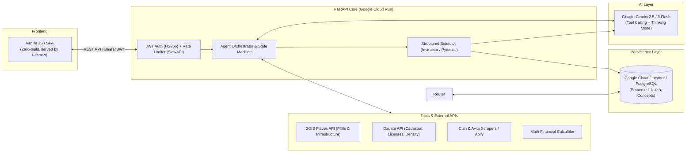

# 🏢 Neks Agents — Commercial Real Estate AI Intelligence Platform

> **Flagship Project** | Multi-Agent AI Platform for Highest & Best Use (HBU) Analysis, Due Diligence & Tenant Mix Modeling.

[](https://www.python.org/)
[](https://fastapi.tiangolo.com/)
[](https://ai.google.dev/)
[](https://cloud.google.com/firestore)
[](https://cloud.google.com/run)

---

## 📺 60–90s Demo Video
> 🎥 **[Смотреть видеодемонстрацию платформы (Loom / YouTube) ↗](https://github.com/Creeepling/neks_agents)**  
> *(Короткий разбор: запуск диалогового агента, работа гео-инструментов 2GIS/Dadata, фиксация структурированных данных и работа с карточкой объекта)*

---

## 🎯 Какую бизнес-задачу решает проект
Комплексный пред-инвестиционный аудит и разработка концепции коммерческой недвижимости (Best Use, аудит ограничений и лицензий, подбор пула арендаторов и финмоделирование) вручную занимают у аналитиков и брокеров **от 3 до 5 рабочих дней**. Процесс фрагментирован: данные собираются из десятков разрозненных источников (Росреестр, карты, классифайды, реестры лицензий), что ведет к потере контекста и ошибкам в расчетах.

**Neks Agents** автоматизирует этот цикл через последовательный конвейер специализированных AI-агентов. Пользователь ведет предметный диалог с профильными цифровыми экспертами, а система гарантированно извлекает факты в единый типизированный профиль объекта без потери контекста.

---

## 👨‍💻 Личный вклад и зона ответственности
Проект полностью спроектирован и разработан мной с нуля:
- **Архитектура бэкенда:** Разработал модульный асинхронный сервер на FastAPI (Python 3.12) с управлением сессиями и изоляцией данных пользователей.
- **Оркестрация LLM & Structured Extraction:** Реализовал двухфазный пайплайн диалога и гарантированной фиксации данных (`/commit`) через библиотеку `instructor` и Pydantic-схемы (100% защита базы данных от галлюцинаций LLM).
- **Интеграция инструментов (Tool Calling):** Написал Tool Registry с каскадным обогащением (2GIS Places API $\to$ Dadata ИНН/лицензии $\to$ парсеры классифайдов).
- **Математический калькулятор и матчинг:** Разработал алгоритм предикатного сопоставления требований ритейлеров (кв.м, кВт) в NoSQL Firestore и финансовый расчет доходности/NOI.
- **Инфраструктура и деплой:** Контейнеризировал сервис (multi-stage Docker) и настроил бессерверный деплой в Google Cloud Run с Cloud SQL/Firestore и Secret Manager.

> ℹ️ **Примечание об авторстве коммитов в Git:**  
> Все коммиты с именем `Neks Dev <dev@neks.local>` в истории репозитория являются моими личными коммитами, сделанными в локальной изолированной среде разработки проекта.

---

## 🏛 Архитектура системы



---

## ⚙️ Ключевые инженерные решения и почему они были выбраны

1. **Двухфазный Commit (Two-Phase Data Extraction) вместо прямого JSON-чата:**  
   *Почему:* Свободный диалог на естественном языке удобен пользователю, но непригоден для строгих БД. Использование `instructor` на этапе завершения шага гарантирует строгую Pydantic-валидацию (типы, enums, вложенные списки) без поломки схемы.
2. **Декларативный конфигуратор агентов (`agents.yaml` + Firestore):**  
   *Почему:* Системные промпты, доступные инструменты и схемы извлечения вынесены в конфиг. Это позволяет менять логику и добавлять новых агентов без модификации и пересборки ядра приложения.
3. **Единый контейнер (FastAPI + SPA Static Serving):**  
   *Почему:* FastAPI напрямую раздает легковесный SPA UI на корневом пути `/`. Это устранило CORS-оверхед, упростило деплой в Google Cloud Run до одного контейнера и исключило рассинхронизацию версий API и интерфейса.
4. **Безопасность и отказоустойчивость:**  
   *Фактический стек защиты:* Авторизация на базе JWT (OAuth2 Password Bearer) с хешированием паролей через `bcrypt`, защита эндпоинтов от спама через `SlowAPI` (120 req/min), изолированное хранение секретов в Google Secret Manager.

---

## 🚦 Статус компонентов: Production-Ready vs Demo/Portfolio

| Модуль / Подсистема | Статус | Описание реализации |
| :--- | :---: | :--- |
| **Auth, JWT, Rate Limiter** | ✅ **Active Core** | Рабочая авторизация пользователей, хеширование bcrypt, лимиты SlowAPI. |
| **State Machine & Multi-Agent Loop** | ✅ **Active Core** | Пошаговый запуск агентов, валидация предусловий `/validate`, изоляция сессий. |
| **Structured Commit (Instructor)** | ✅ **Active Core** | Надежный парсинг диалогов в JSON с валидацией Pydantic-моделями. |
| **Интеграции Dadata & 2GIS** | ✅ **Active Core** | Геокодинг, проверка плотности юрлиц и реестров алкогольных/медицинских лицензий. |
| **OCR & Multimodal парсер ЕГРН** | ✅ **Active Core** | Извлечение кадастровых данных и обременений из сканов/PDF через Gemini Vision. |
| **Tenant Matching & FinCalc** | 🟡 **Demo / MVP** | Матчинг по предзаполненной базе ритейлеров в Firestore и расчет базовой финмодели. |
| **Cian / Market Offers Scraper** | 🟡 **Demo / Lab** | Прототипный парсинг открытых листингов (требует прокси-пула в high-load). |

---

## 🚀 Local Development Setup

### 1. Create and Activate Virtual Environment
```bash
python -m venv .venv
# Windows:
.venv\Scripts\activate
# Mac/Linux:
source .venv/bin/activate
```

### 2. Install Dependencies
```bash
pip install -r requirements.txt
```

### 3. Configure Google Cloud Credentials
Authenticate your local environment to access Firestore:
```bash
gcloud auth application-default login
```
*(Or set `GOOGLE_APPLICATION_CREDENTIALS="path/to/service-account.json"` in your environment)*

### 4. Configure Environment Variables
Copy the template `.env.example` to `.env` and fill in your keys:

```bash
cp .env.example .env
```

Example `.env`:
```env
# Required: Google Gemini API Key (https://aistudio.google.com/)
GEMINI_API_KEY=your-gemini-api-key
GEMINI_MODEL=gemini-3-flash-preview

# Required: Firestore Configuration
FIRESTORE_PROJECT_ID=your-gcp-project-id
FIRESTORE_DATABASE_ID=neksagents

# Required: Secret Key for JWT Authentication
# Generate with: python -c "import secrets; print(secrets.token_hex(32))"
SECRET_KEY=your-secure-secret-key
ALGORITHM=HS256
ACCESS_TOKEN_EXPIRE_MINUTES=1440

# Optional / Tool Integrations:
DADATA_API_KEY=your-dadata-api-key
TWOGIS_API_KEY=your-2gis-api-key
APIFY_API_TOKEN=your-apify-token

# Optional: Telegram Diagnostics Notifications
TELEGRAM_BOT_TOKEN=your-bot-token
TELEGRAM_CHAT_ID=your-chat-id

ENVIRONMENT=local
```

### 5. Run the Development Server
```bash
uvicorn app.main:app --reload
```

- Web UI: `http://localhost:8000/`
- Interactive Swagger Docs: `http://localhost:8000/docs`
- OpenAPI Specification: `http://localhost:8000/openapi.json`

---

## 📡 API Overview

### Authentication
| Method | Endpoint | Description |
|--------|----------|-------------|
| `POST` | `/auth/register` | Register a new user |
| `POST` | `/auth/token` | Login and obtain JWT access token |

### Properties & Real Estate Objects
| Method | Endpoint | Description |
|--------|----------|-------------|
| `GET` | `/properties` | List all properties for current user |
| `POST` | `/properties` | Create a new property |
| `GET` | `/properties/{id}` | Get property details and accumulated JSON data |
| `PUT` | `/properties/{id}` | Update property details |
| `DELETE` | `/properties/{id}` | Delete property and associated data |
| `POST` | `/properties/{id}/documents` | Upload and summarize property document |
| `DELETE` | `/properties/{id}/documents/{doc_id}` | Remove document from property |
| `POST` | `/properties/{id}/egrn_extracts` | Upload and parse EGRN (Rosreestr) extract |
| `DELETE` | `/properties/{id}/egrn_extracts/{doc_id}` | Remove EGRN extract |
| `POST` | `/properties/{id}/cian_offers` | Trigger CIAN market offers scraping |
| `GET` | `/properties/{id}/cian_offers` | Retrieve saved CIAN market offers |
| `POST` | `/properties/{id}/cian_offers/clear` | Clear saved market offers |
| `POST` | `/properties/{id}/fetch_tenants` | Pull tenant infrastructure via 2GIS |
| `POST` | `/properties/{id}/fetch_tenants_ai` | AI-assisted tenant and foot-traffic discovery |

### Conversations & Agents
| Method | Endpoint | Description |
|--------|----------|-------------|
| `GET` | `/conversations/validate` | Pre-flight validation of prerequisite data for a step |
| `POST` | `/conversations` | Initialize a conversation for a property & agent step |
| `GET` | `/conversations/{id}` | Get conversation metadata and full message history |
| `POST` | `/conversations/{id}/message` | Send user message and get agent response (with tool execution) |
| `POST` | `/conversations/{id}/commit` | Extract structured schema data and merge into property |
| `POST` | `/conversations/{id}/complete` | Mark conversation as completed |
| `DELETE` | `/conversations/{id}` | Delete conversation |

### Retailers & Concepts
| Method | Endpoint | Description |
|--------|----------|-------------|
| `GET` | `/retailers` | List retail tenant requirement profiles |
| `POST` | `/retailers` | Create a retailer requirement profile |
| `PUT` | `/retailers/{id}` | Update retailer profile |
| `DELETE` | `/retailers/{id}` | Delete retailer profile |
| `POST` | `/retailers/auto-fill` | Auto-fill retailer profile data using AI |
| `GET` | `/concepts` | List commercial property concepts |
| `POST` | `/concepts` | Create a commercial concept |
| `PUT` | `/concepts/{id}` | Update commercial concept |
| `DELETE` | `/concepts/{id}` | Delete commercial concept |

### System & Pipeline Configuration
| Method | Endpoint | Description |
|--------|----------|-------------|
| `GET` | `/steps` | List active agent steps and metadata |
| `GET` | `/system/tools` | List available agent tools and descriptions |
| `GET` | `/system/agents-config/json` | Retrieve current agent pipeline configuration |
| `PUT` | `/system/agents-config/json` | Update pipeline configuration dynamically in Firestore |
| `POST` | `/system/agents-config/reset` | Reset pipeline configuration to default `agents.yaml` |
| `POST` | `/system/seed-retailers` | Seed default retail tenant profiles |
| `POST` | `/system/seed-concepts` | Seed default commercial concept profiles |

---

## 🛠 Agent Pipeline Configuration

Agent steps are declared in `agents.yaml` (or customized at runtime in Firestore). Each step defines:
- **`name`** & **`role`**: Descriptive title and system identity.
- **`system_prompt`**: Specialized instructions and analytical guidelines.
- **`tools`**: Bound capabilities (e.g. `twogis_maps`, `dadata_licenses`, `financial_calculator`).
- **`input_requirements`**: Prerequisite property fields checked before starting.
- **`output_schema`**: JSON Schema extracted upon `/commit` and merged into the property store.

---

## ☁️ Deployment (Google Cloud Run)

The application is containerized and optimized for Google Cloud Run with Firestore.

### 1. Build and Submit Container Image
```bash
export PROJECT_ID=your-gcp-project-id
export REGION=europe-west1

gcloud builds submit --tag gcr.io/$PROJECT_ID/neks-agents
```

### 2. Deploy to Cloud Run
```bash
gcloud run deploy neks-agents \
  --image gcr.io/$PROJECT_ID/neks-agents \
  --region $REGION \
  --allow-unauthenticated \
  --set-env-vars "FIRESTORE_PROJECT_ID=$PROJECT_ID,FIRESTORE_DATABASE_ID=neksagents,GEMINI_MODEL=gemini-3-flash-preview,ENVIRONMENT=production" \
  --set-secrets "GEMINI_API_KEY=GEMINI_API_KEY:latest,SECRET_KEY=SECRET_KEY:latest,DADATA_API_KEY=DADATA_API_KEY:latest,TWOGIS_API_KEY=TWOGIS_API_KEY:latest,APIFY_API_TOKEN=APIFY_API_TOKEN:latest"
```

> **Note**: Ensure the Cloud Run service account has the **Cloud Datastore User** (`roles/datastore.user`) role to access Firestore Native databases.
