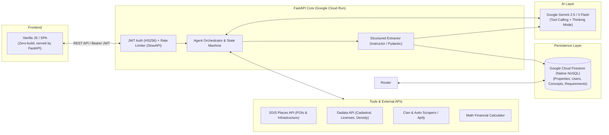

# 🏢 Neks Agents — Commercial Real Estate AI Intelligence Platform

> **Flagship Project** | Мультиагентная AI-платформа для анализа наилучшего использования (HBU), due diligence и подбора пула арендаторов коммерческой недвижимости.

[](https://www.python.org/)
[](https://fastapi.tiangolo.com/)
[](https://ai.google.dev/)
[](https://cloud.google.com/firestore)
[](https://cloud.google.com/run)

[🇺🇸 English Version](README.md)

---

## 📺 60–90s Demo Video
> 🎥 **[Смотреть видеодемонстрацию платформы на YouTube ↗](https://youtu.be/ed7S6_05rxM)**  
> *(Короткий разбор: запуск диалогового агента, работа гео-инструментов 2GIS/Dadata, фиксация структурированных данных и работа с карточкой объекта)*

---

## 🎯 Какую бизнес-задачу решает проект
Комплексный пред-инвестиционный аудит и разработка концепции коммерческой недвижимости (Best Use, аудит ограничений и лицензий, подбор пула арендаторов и финмоделирование) вручную занимают у аналитиков и брокеров **от 3 до 5 рабочих дней**. Процесс фрагментирован: данные собираются из десятков разрозненных источников (Росреестр, карты, классифайды, реестры лицензий), что ведет к потере контекста и ошибкам в расчетах.

**Neks Agents** автоматизирует этот цикл через последовательный конвейер специализированных AI-агентов. Пользователь ведет предметный диалог с профильными цифровыми экспертами, а система гарантированно извлекает факты в единый типизированный профиль объекта без потери контекста.

---

## 👨‍💻 Личный вклад и зона ответственности
Проект полностью спроектирован и разработан мной с нуля:
- **Архитектура бэкенда:** Разработал модульный асинхронный сервер на FastAPI (Python 3.12) с управлением сессиями и изоляцией данных пользователей.
- **Оркестрация LLM & Structured Extraction:** Реализовал двухфазный пайплайн диалога и гарантированной фиксации данных (`/commit`) через библиотеку `instructor` и Pydantic-схемы (100% защита базы данных от галлюцинаций LLM).
- **Интеграция инструментов (Tool Calling):** Написал Tool Registry с каскадным обогащением (2GIS Places API $\to$ Dadata ИНН/лицензии $\to$ парсеры классифайдов).
- **Математический калькулятор и матчинг:** Разработал алгоритм предикатного сопоставления требований ритейлеров (кв.м, кВт) в NoSQL Firestore и финансовый расчет доходности/NOI.
- **Инфраструктура и деплой:** Контейнеризировал сервис (multi-stage Docker) и настроил бессерверный деплой в Google Cloud Run с Cloud SQL/Firestore и Secret Manager.

> ℹ️ **Примечание об авторстве коммитов в Git:**  
> Все коммиты с именем `Neks Dev <dev@neks.local>` в истории репозитория являются моими личными коммитами, сделанными в локальной изолированной среде разработки проекта.

---

## 🏛 Архитектура системы



---

## ⚙️ Ключевые инженерные решения и почему они были выбраны

1. **Двухфазный Commit (Two-Phase Data Extraction) вместо прямого JSON-чата:**  
   *Почему:* Свободный диалог на естественном языке удобен пользователю, но непригоден для строгих БД. Использование `instructor` на этапе завершения шага гарантирует строгую Pydantic-валидацию (типы, enums, вложенные списки) без поломки схемы.
2. **Декларативный конфигуратор агентов (`agents.yaml` + Firestore):**  
   *Почему:* Системные промпты, доступные инструменты и схемы извлечения вынесены в конфиг. Это позволяет менять логику и добавлять новых агентов без модификации и пересборки ядра приложения.
3. **Единый контейнер (FastAPI + SPA Static Serving):**  
   *Почему:* FastAPI напрямую раздает легковесный SPA UI на корневом пути `/`. Это устранило CORS-оверхед, упростило деплой в Google Cloud Run до одного контейнера и исключило рассинхронизацию версий API и интерфейса.
4. **Безопасность и отказоустойчивость:**  
   *Фактический стек защиты:* Авторизация на базе JWT (OAuth2 Password Bearer) с хешированием паролей через `bcrypt`, защита эндпоинтов от спама через `SlowAPI` (120 req/min), изолированное хранение секретов в Google Secret Manager.

---

## 🚦 Статус компонентов: Production-Ready vs Demo/Portfolio

| Модуль / Подсистема | Статус | Описание реализации |
| :--- | :---: | :--- |
| **Auth, JWT, Rate Limiter** | ✅ **Active Core** | Рабочая авторизация пользователей, хеширование bcrypt, лимиты SlowAPI. |
| **State Machine & Multi-Agent Loop** | ✅ **Active Core** | Пошаговый запуск агентов, валидация предусловий `/validate`, изоляция сессий. |
| **Structured Commit (Instructor)** | ✅ **Active Core** | Надежный парсинг диалогов в JSON с валидацией Pydantic-моделями. |
| **Интеграции Dadata & 2GIS** | ✅ **Active Core** | Геокодинг, проверка плотности юрлиц и реестров алкогольных/медицинских лицензий. |
| **OCR & Multimodal парсер ЕГРН** | ✅ **Active Core** | Извлечение кадастровых данных и обременений из сканов/PDF через Gemini Vision. |
| **Tenant Matching & FinCalc** | 🟡 **Demo / MVP** | Матчинг по предзаполненной базе ритейлеров в Firestore и расчет базовой финмодели. |
| **Cian / Market Offers Scraper** | 🟡 **Demo / Lab** | Прототипный парсинг открытых листингов (требует прокси-пула в high-load). |

---

## 🚀 Локальный запуск (Local Development)

### 1. Создание виртуального окружения
```bash
python -m venv .venv
# Windows:
.venv\Scripts\activate
# Mac/Linux:
source .venv/bin/activate
```

### 2. Установка зависимостей
```bash
pip install -r requirements.txt
```

### 3. Авторизация в Google Cloud (Firestore)
```bash
gcloud auth application-default login
```
*(Или укажите путь `GOOGLE_APPLICATION_CREDENTIALS="path/to/service-account.json"`)*

### 4. Настройка переменных окружения (.env)
```bash
cp .env.example .env
```

Пример `.env`:
```env
GEMINI_API_KEY=your-gemini-api-key
GEMINI_MODEL=gemini-3-flash-preview
FIRESTORE_PROJECT_ID=your-gcp-project-id
FIRESTORE_DATABASE_ID=neksagents
SECRET_KEY=your-secure-secret-key
ALGORITHM=HS256
ACCESS_TOKEN_EXPIRE_MINUTES=1440
DADATA_API_KEY=your-dadata-api-key
TWOGIS_API_KEY=your-2gis-api-key
APIFY_API_TOKEN=your-apify-token
ENVIRONMENT=local
```

### 5. Запуск сервера разработки
```bash
uvicorn app.main:app --reload
```

- Web UI: `http://localhost:8000/`
- Interactive Swagger Docs: `http://localhost:8000/docs`
- OpenAPI Specification: `http://localhost:8000/openapi.json`

---

## 📡 Обзор API

### Authentication
| Method | Endpoint | Description |
|--------|----------|-------------|
| `POST` | `/auth/register` | Регистрация нового пользователя |
| `POST` | `/auth/token` | Авторизация и получение JWT токена |

### Properties & Real Estate Objects
| Method | Endpoint | Description |
|--------|----------|-------------|
| `GET` | `/properties` | Список объектов текущего пользователя |
| `POST` | `/properties` | Создание объекта недвижимости |
| `GET` | `/properties/{id}` | Получение объекта и накопленного JSON профиля |
| `PUT` | `/properties/{id}` | Обновление данных объекта |
| `DELETE` | `/properties/{id}` | Удаление объекта и его диалогов |
| `POST` | `/properties/{id}/documents` | Загрузка и AI-саммаризация документа |
| `DELETE` | `/properties/{id}/documents/{doc_id}` | Удаление документа |
| `POST` | `/properties/{id}/egrn_extracts` | Загрузка и парсинг выписки ЕГРН (Росреестр) |
| `DELETE` | `/properties/{id}/egrn_extracts/{doc_id}` | Удаление выписки ЕГРН |
| `POST` | `/properties/{id}/cian_offers` | Запуск сбора предложений с ЦИАН |
| `GET` | `/properties/{id}/cian_offers` | Получение собранных предложений ЦИАН |
| `POST` | `/properties/{id}/cian_offers/clear` | Очистка предложений |
| `POST` | `/properties/{id}/fetch_tenants` | Поиск окружения и арендаторов через 2GIS |
| `POST` | `/properties/{id}/fetch_tenants_ai` | AI-скоринг арендаторов и пешеходного трафика |

### Conversations & Agents
| Method | Endpoint | Description |
|--------|----------|-------------|
| `GET` | `/conversations/validate` | Проверка наличия обязательных данных перед стартом шага |
| `POST` | `/conversations` | Создание новой сессии диалога для этапа |
| `GET` | `/conversations/{id}` | Получение сессии и истории сообщений |
| `POST` | `/conversations/{id}/message` | Отправка сообщения пользователем и ответ агента (с вызовом tools) |
| `POST` | `/conversations/{id}/commit` | Извлечение типизированных данных и запись в объект |
| `POST` | `/conversations/{id}/complete` | Завершение сессии диалога |
| `DELETE` | `/conversations/{id}` | Удаление диалога |

### Retailers & Concepts
| Method | Endpoint | Description |
|--------|----------|-------------|
| `GET` | `/retailers` | Список профилей требований ритейлеров |
| `POST` | `/retailers` | Создание профиля ритейлера |
| `PUT` | `/retailers/{id}` | Обновление профиля ритейлера |
| `DELETE` | `/retailers/{id}` | Удаление профиля ритейлера |
| `POST` | `/retailers/auto-fill` | Автозаполнение профиля ритейлера через AI |
| `GET` | `/concepts` | Список концепций коммерческой недвижимости |
| `POST` | `/concepts` | Создание концепции |
| `PUT` | `/concepts/{id}` | Обновление концепции |
| `DELETE` | `/concepts/{id}` | Удаление концепции |

---

## ☁️ Развертывание (Google Cloud Run)

```bash
export PROJECT_ID=your-gcp-project-id
export REGION=europe-west1

# Сборка и отправка образа
gcloud builds submit --tag gcr.io/$PROJECT_ID/neks-agents

# Деплой в Cloud Run
gcloud run deploy neks-agents \
  --image gcr.io/$PROJECT_ID/neks-agents \
  --region $REGION \
  --allow-unauthenticated \
  --set-env-vars "FIRESTORE_PROJECT_ID=$PROJECT_ID,FIRESTORE_DATABASE_ID=neksagents,GEMINI_MODEL=gemini-3-flash-preview,ENVIRONMENT=production" \
  --set-secrets "GEMINI_API_KEY=GEMINI_API_KEY:latest,SECRET_KEY=SECRET_KEY:latest,DADATA_API_KEY=DADATA_API_KEY:latest,TWOGIS_API_KEY=TWOGIS_API_KEY:latest,APIFY_API_TOKEN=APIFY_API_TOKEN:latest"
```
